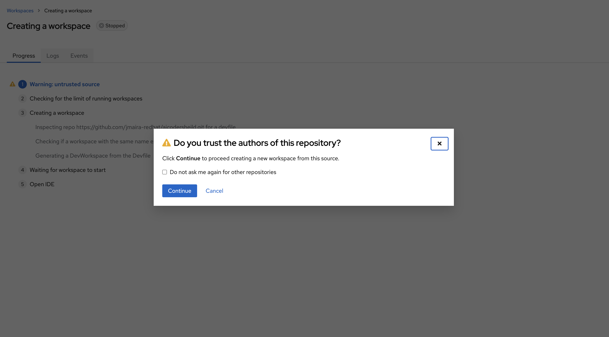
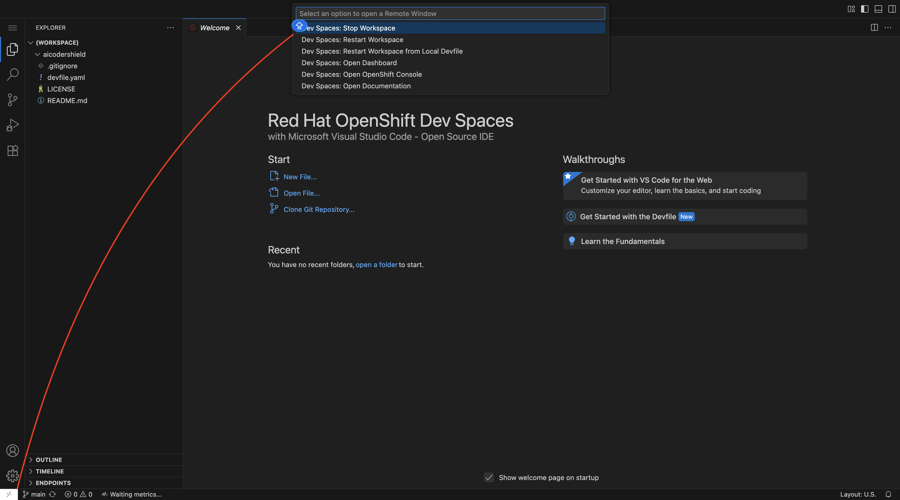
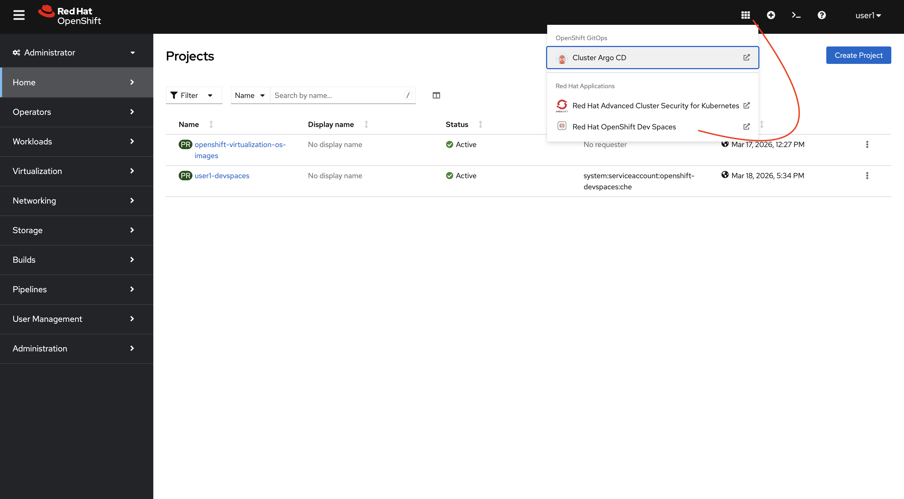
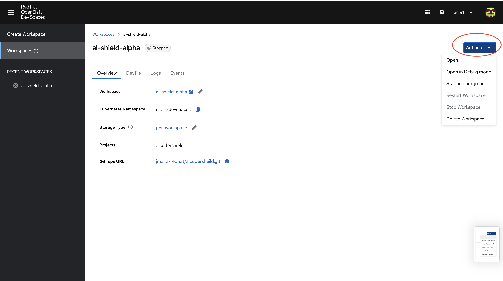
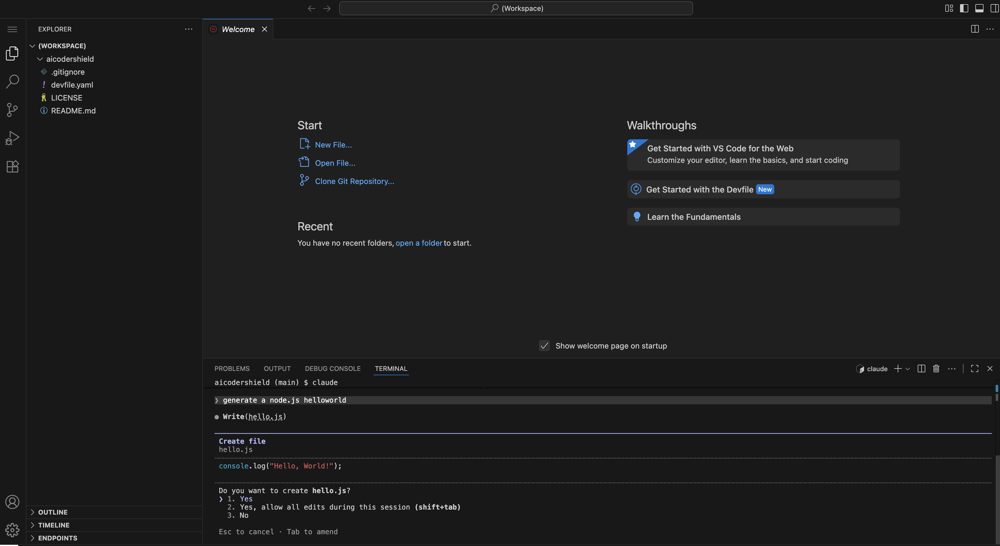

# aikeysforenterprise# 

# 🛡️ Project Shield: Zero-Trust AI Development#

This repository contains the infrastructure-as-code required to securely govern AI API keys (Claude/OpenAI) on Red Hat OpenShift using External Secrets and Dev Spaces.

## 🚀 Set up as a Cluster Admin user playing the ANTHROPIC keys Owner

### Admin - 1. Initialize the Vault
Create the restricted namespace and add your master keys.
```bash
oc new-project project-shield-hub
oc create secret generic ai-shield-master-creds --from-literal=ANTHROPIC_API_KEY=sk-ant-xxx -n project-shield-hub
```
### Admin - 2. Deploy the Governance Layer
```bash
oc apply -f 01-shield-sa.yaml
oc apply -f 02-shield-rbac.yaml
oc apply -f 03-cluster-store.yaml
```
## 👨‍💻 Developer Onboarding (user1)

The journey begins with `user1` requesting a workspace. At this stage, the environment is a "blank slate" before the administrative security policies are applied.

### 1. Creating the Workspace
The developer logs into the Red Hat OpenShift Dev Spaces dashboard and initiates a new workspace using the Project Shield repository.

```
logout as admin from the ocp console
login as user1 (developer user)

https://devspaces.apps.<CLUSTER_ID>.<CLUSTER_DOMAIN>/#https://github.com/jmaira-redhat/aikeysforenterprise.git?name=ai-shield-alpha

```


*Figure 1: user1 initiating the 'ai-shield-alpha' workspace from the central dashboard.*

---

To allow the Project Shield to sync the API keys from the Hub to the Developer's namespace, the workspace must be momentarily stopped. This ensures that the next time the container starts, it "sees" the newly injected environment variables.


*Figure 2: user1 stoping the 'ai-shield-alpha' workspace .*

### Admin - 3. Deploy the User Bridge
Target the user's runtime namespace
```bash
oc get namespaces | grep user1-devspaces
Expected Output
✅ user1-devspaces                                    Active   4m21s
# (Let's assume it is user1-devspaces for the commands below).
oc apply -f 04-external-secret.yaml -n user1-devspaces
✅  externalsecret.external-secrets.io/ai-shield-keys created
```
### 4. The Pre-Flight Gatekeeper
This script checks the Hub, the Store, and the User Workspace to ensure every "link" in the chain is secure.
```
edit the script 00-verify-shield.sh and make sure USER_NS="user1-devspaces" or the one generated by your devspace creation
./00-verify-shield.sh
Expected Output
🔍 Starting Project Shield Pre-Flight Check...
-----------------------------------------------
✅ [HUB] Master Secret found in project-shield-hub
✅ [BRIDGE] ClusterSecretStore 'project-shield-vault' is READY
✅ [USER] Local Secret 'ai-creds' has been synchronized
✅ [METADATA] Injection Labels are CORRECT
✅ [METADATA] Injection Annotation is CORRECT
-----------------------------------------------
🚀 SHIELD VERIFIED: Safe to launch 05-dev-workspace.yaml
```
## 👨‍💻 Developer Onboarding (user1) with ANTHROPIC Keys
Once the Admin has provisioned the environment, follow these steps to access your secure AI workspace.
### 1. Access the Workspace
The Project Lead will provide a unique URL for your pre-provisioned workspace. 
* **URL Format:** `https://devspaces.apps.<CLUSTER_ID>.<CLUSTER_DOMAIN>/dashboard/#/workspace/user1-devspaces/ai-shield-alpha`

Or as user1 (Developer user) access the devspace dashboard and reopen your workspace as follows



*Figure 3: user1 open devspaces dashboard .*



*Figure 34: user1 re-open 'ai-shield-alpha' workspace  .*


### 2. Verify the AI Shield
Open a terminal inside the IDE (Terminal -> New Terminal) and run the verification suite:

```bash
# Check if the Claude CLI is ready
claude --version
Expected output
✅  2.1.79 (Claude Code)

# Check if the Anthropic API Key is securely injected
if [[ -n "$ANTHROPIC_API_KEY" ]]; then
  echo "✅ Project Shield Active. Ready to code."
else
  echo "❌ Shield Error: API Key missing. Contact your Admin."
fi

Expected out out
✅ Project Shield Active. Ready to code.

```
Or Run a cluade code cli test as follows


*Figure 34: user1 re-open 'ai-shield-alpha' workspace  .*